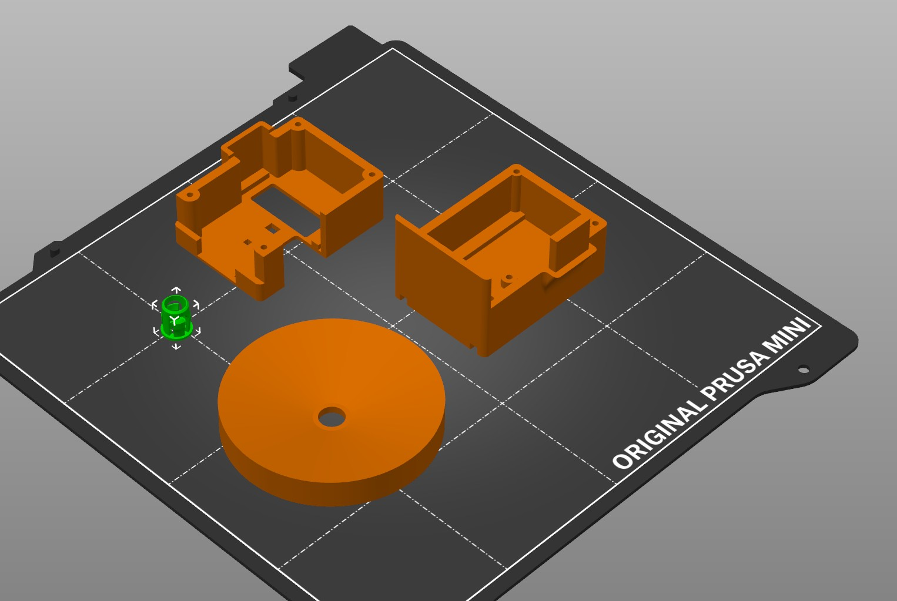

# 3D files for shutterTimeSensor enclosure

These files are used for 3d printing the case.  
Case uses M2 allen head bolts (10mm), threaded directly into the lower case. (upper case m2 hole should be opened up to let threads clearance fit)

5mm LED holder (green on plater) from firstgizmo on printables, to fit into lens cap
Though, lens cap assy is not necessary, the sensor does not false trip by ambient light in general.

