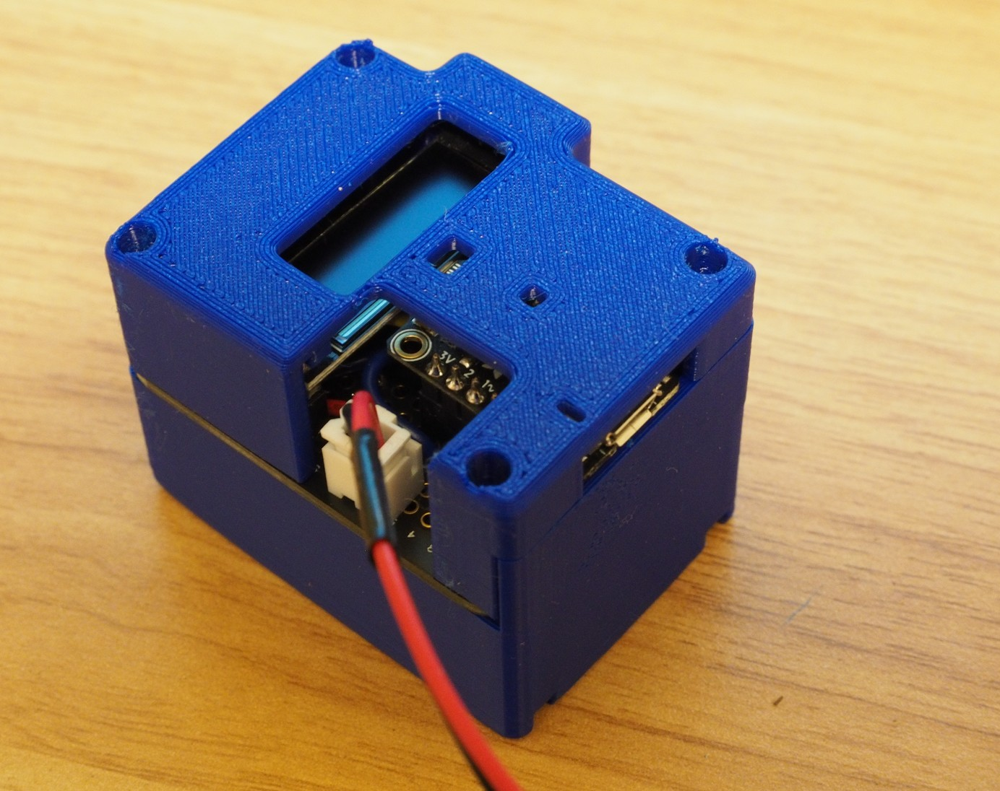
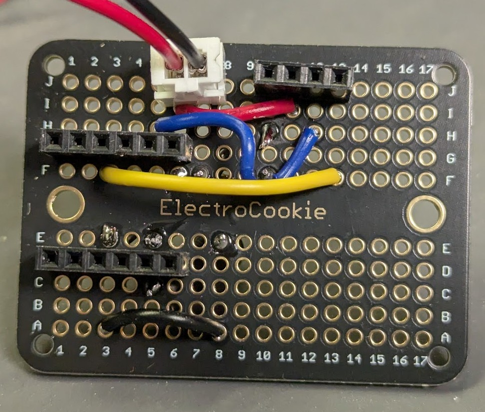
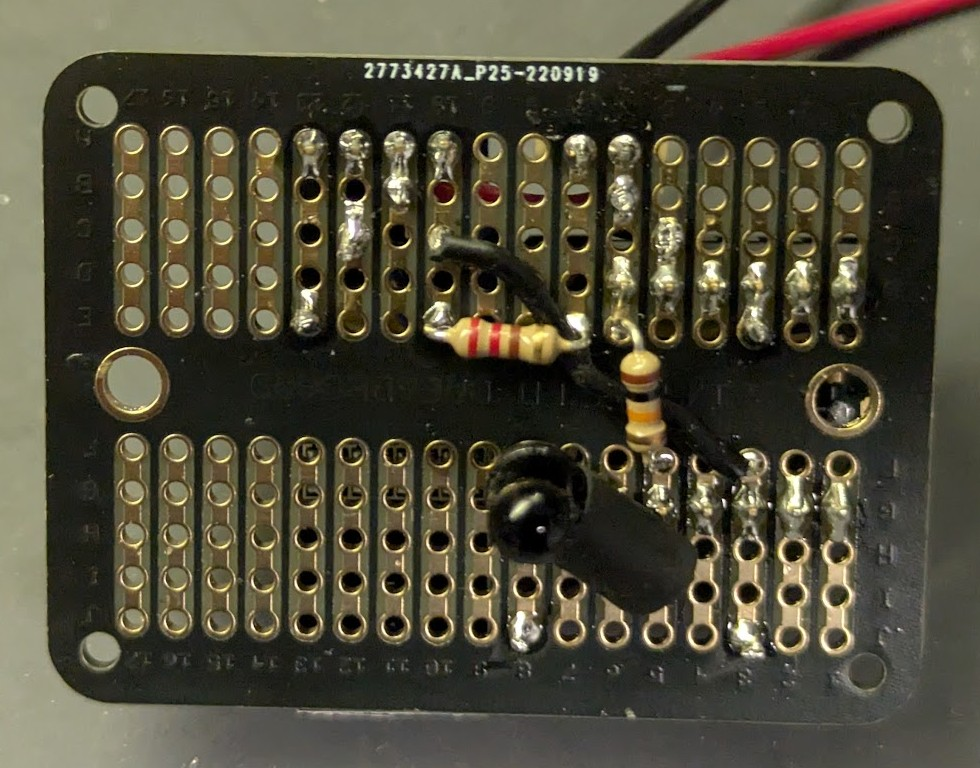
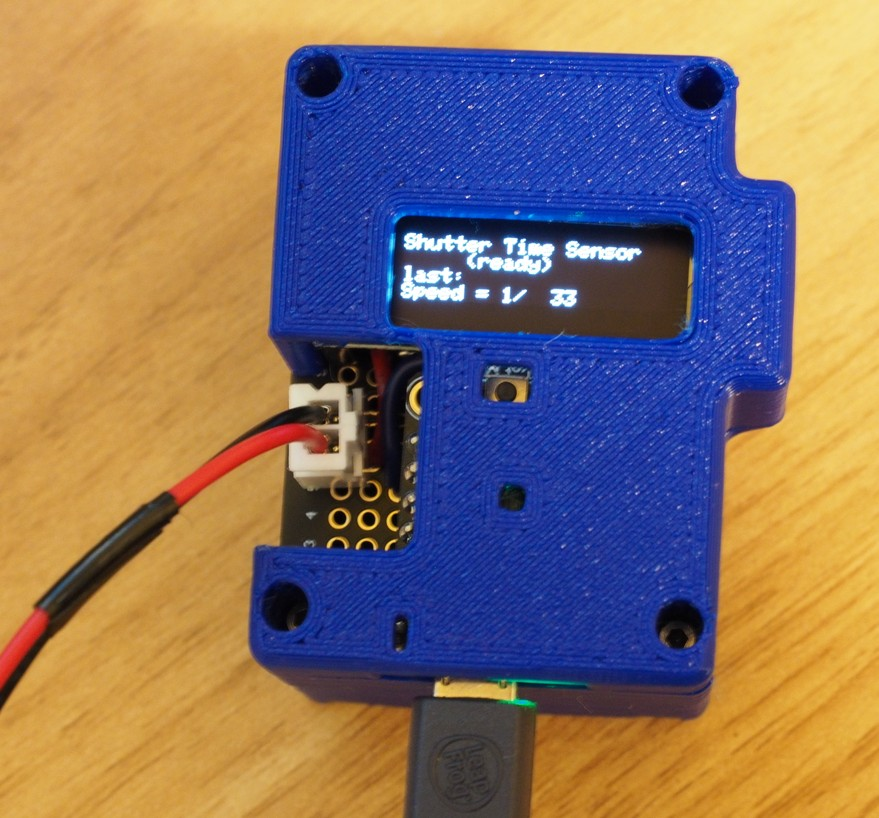

# shutterTimeSensor

sshutter speed sensor gadget using TrinketM0 and IR emitter and photodiode

****Code: ****

See "*ShutterTimeSensor*" folder for VSCode and PlatformIO project

*src\main.cpp* is the program

*platformio.ini* 'PlatformIO Project Configuration File' shows the framework and dependancies

**Schematic**

**Breadboard (with test button for IR light, not used in final build)**

**Soldered on protoboard**

**Encased and running**

**Results:**

Of course could be improved with a pcb, and expanded with multiple sensors to measure speed across a film plane, but, this seems to work!  
My excellent condition Trip35 1/40s flash setting setting measures between 1/37 and 1/40 of a second, so I think we're in the ballpark.  

I've seen recently shutter timers using a 555 timer, not sure if that would bring better accuracy for high speed shutters.

**Shutter speed accuracy and high speeds/short duration:**  
I did make some small effort to 'blinder' the photodiode path to measure a 'small' area of the film surface.  And I'm using compiled c++ (arduino) code and "micros() command.  
The code alone can read out result values well faster than 1/10,000s but at high speeds I don't know how much % error may be due to photodiode reaction time, ADC time, code loop time, and the diode mounting and 'blinder'ing.    

I've seen shutter timers using a 555 timer, not sure if that would bring better accuracy for high speed shutters.  If going high-speed, I would want to investigate more seriously into the code loop vs interrupt method, photodiode reaction time, and better lensing/focusing for the IR before worrying about "micros()" and a 555 timer...

At least I think this is better than some python timing code and a bare photodiode!
